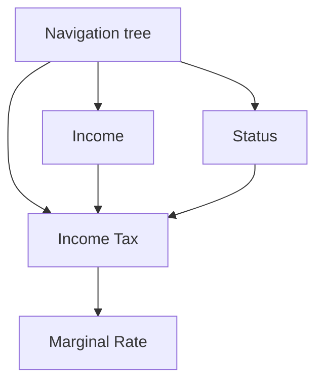
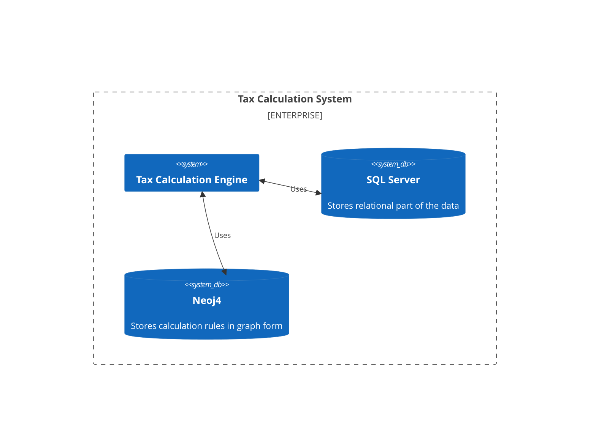

# Trade-off analysis: Calculation engine storage

## Scenario

The Tax Calculation software allows to enter various fields and the tax calculation engine will calculate the result based on complex rules.
Some of the fields are dependent on the answers to other fields and form a tree of dependencies.

This trade-off analysis is evaluating different architectural approaches for storage of the data for the calculation engine that includes rules and input data.

## Attributes

- Performance: The ability of the chosen storage to handle complex calculations efficiently.
- Portability: The calculation engine shall be portable to other platforms, including web and mobile.
- Compatibility: The client maintains a legacy desktop software that is biased towards MS SQL Server storage. Also they have people with SQL Server expertise.

## Environment

- Web interface is dynamic and what is show managed by tax rules or form definition in tax rules.
- Fields on the form can trigger recalculation resulting in numeric values recalc (e.g., Forecasted Refund) or answers to questions in interface activate new fields.
- It shall be possible for accountant to change tax rules and form at any time without rebuild of the software.
- Client is biased towards MS SQL Server storage.
- Rules for the calculation engine are similar to a DAG (Directed Acyclic Graph) with nodes being the forms with formulas or input fields and edges being the dependencies between them.

## Response

- Recalculations shall be performed fast under the 1s at 100 requests per second load for a back-end solution.
- Recalculations shall be performed under 1s for a front-end (mobile/web) solution.
- Tax calculation engine is portable to other platforms, including web and mobile.

## Architectural approaches

### Example for comparison

The following example is used for comparison of the different approaches.

Let's assume that the calculation engine has the following rules:

### MS SQL Server

SQL Server is a mature relational database management system that is widely used in the industry. It can be used to store various types of data, including graph data using [SQL Graph feature](https://learn.microsoft.com/en-us/sql/relational-databases/graphs/sql-graph-overview?view=sql-server-ver16).

Here is an example of a graph data model for the calculation engine rules:

| $node_id               | Formula                                                                                | Title           | Type        |
|------------------------|----------------------------------------------------------------------------------------|-----------------|-------------|
| {"type":"node","Id":0} |                                                                                        | Tax Calculation | Root        |
| {"type":"node","Id":1} | $Income                                                                                | Income          | Input field |
| {"type":"node","Id":2} | $Status                                                                                | Martial status  | Input field |
| {"type":"node","Id":3} | =IF($Status='Single', $Income*10%)                                                     | Tax             | Formula     |
| {"type":"node","Id":4} | =IFS($Tax>0 AND $Tax<10000, 25%, $Tax >10000 AND $Tax < 20000, 50%, $Tax >20000, 75%)  | Marginal Rate   | Formula     |

| $edge_id                 | $from_id                 | $to_id                   | lazy  |
|--------------------------|--------------------------|--------------------------|-------|
| {"type":"edge", "id": 0} | {"type":"node", "id": 0} | {"type":"node", "id": 1} | true  |
| {"type":"edge", "id": 1} | {"type":"node", "id": 0} | {"type":"node", "id": 2} | true  |
| {"type":"edge", "id": 2} | {"type":"node", "id": 0} | {"type":"node", "id": 3} | true  |
| {"type":"edge", "id": 3} | {"type":"node", "id": 1} | {"type":"node", "id": 3} | false |
| {"type":"edge", "id": 4} | {"type":"node", "id": 2} | {"type":"node", "id": 3} | false |
| {"type":"edge", "id": 5} | {"type":"node", "id": 3} | {"type":"node", "id": 4} | false |

The data model consists of two tables: `nodes` and `edges`. The `nodes` table contains the nodes of the graph and the `edges` table contains the edges of the graph.

The input fields for the calculation engine can be stored as a separate KEY-VALUE like table:

| $node_id               | $value |
|------------------------|--------|
| $Income                | 10000  |
| $Status                | Single |

The calculation engine can be implemented as a micro-service that reads rules from the SQL Server into memory-optimize DAG structures and then performs the calculations using input fields.
The logic of the calculation engine can be re-used in a web or mobile client without deep linking to the underlying rules schema in SQL Server, however there would be a need for a traslation layer between the SQL Server schema and the internal graph data model of the calculation engine.

#### Performance

In a relational database, when you look up a record in storage, generally the next record is stored right next to it in storage. We might call this a "natural index" because if what you want to do is scan through a bunch of records, the relational structure is just fundamentally set up to make that perform really well.

Graph databases on the other hand are generally naturally indexed by relationships. This means that in general, graph databases traverse relationships very quickly, but perform less well on mass/bulk queries.

In general, SQL Server performance will be much slower for queries that requires traversing the graph and much faster for queries that require SQL-like operations without traversing the graph.

[According to Neo4j](https://neo4j.com/news/how-much-faster-is-a-graph-database-really/) the time to traverse for 2nd degree connections graph database is 60% faster, and for 3rd degree connections graph database is 180 times faster.

#### Outcomes

Pros:

- Client preference for MS SQL Server is satisfied.
- A single storage for both rules, input data, and other system data.
- Available as a managed cloud solution in Azure.

Cons:

- Performance of the calculation engine is significantly slower for queries that require traversing the graph.
- The storage schema is technically and mentally complex and requires a lot of effort to implement and maintain.
- Object-relational impedance mismatch
- Licensing costs for SQL Server Enterprise Edition.

### Azure Cosmos DB with Gremlin API

Azure Cosmos DB is a globally distributed, multi-model database service that supports document, key-value, wide-column, and graph databases. It is a NoSQL database that supports multiple APIs, including Gremlin API for graph databases. It supports Apache TinkerPop graph computing framework.

The graph database with Gremlin API can be used to store the rules for the calculation engine in a native graph format. The input data can be stored in a separate document database.
The calculation engine can be implemented as a micro-service that reads rules from the graph database into memory-optimize DAG structures.

#### Performance

Cosmos DB is a cloud database and its performance depends on the selected capacity mode and provisioned thoughput. In general, we can say that the performance of graph queries is significantly faster than SQL Server (2X+) and is comparable with Neo4j in a similar environment.

However, to gain a signficant performance boost against SQL Server, the calculation engine queries must be optimized in the following way:

- Apply filters early and aggressively
- Label edges to filter out irrelevant edges
- Try to not visit the same vertices multiple times
- Use lables to filter out irrelevant vertices
- Write queries so that the scope of a predicate is as narrow as possible

One of the main benefits of using Azure Cosmos DB is that it is a managed cloud solution that supports elastic scaling with distributed data using graph partitioning.

#### Outcomes

Pros:

- Performance of the calculation engine is significantly faster that relational database for optimized queries.
- Native graph schema for the calculation engine rules.
- Azure Cosmos DB is a managed cloud solution that supports elastic scaling and high availability.
- Powerful query language for graph databases.

Cons:

- Query language is not SQL-like and requires specialized knowledge.
- The storage schema should be selected carefully to avoid performance issues.
- Query language can limit the functionality of the calculation engine.

### Neo4j+SQL Server

Neo4j is a native graph database that supports ACID transactions and is optimized for storing and querying graphs. It supports the Cypher query language.
Neo4j can store the rules for the calculation engine in a native graph format. The input data can be stored in a separate SQL Server database.

#### Performance

See [Azure Cosmos DB with Gremlin API](#azure-cosmos-db-with-gremlin-api) for performance comparison.

#### Outcomes

Pros:

- Performance of the calculation engine is significantly faster that relational database for optimized queries.
- Native graph schema for the calculation engine rules.
- Powerful query language for graph databases.

Cons:

- Requires two separate storage products to store rules and input data.
- The storage schema should be selected carefully to avoid performance issues.
- Query language can limit the functionality of the calculation engine.

## Trade-off analysis table

|    Architectural Decisions    | Sensitivity | Trade-off | Risk | Non-risk |
|-------------------------------|-------------|-----------|------|----------|
| MS SQL Server                 | S1          |           | R1   |          |
| Azure Cosmos DB               |             |           |      | N1       |
| Neo4j+SQL Server              |             | T1        | R2   |          |

## Reasoning

**R1**: SQL Server performance for graph queries is significantly slower than native graph databases. Depending on the complexity of the calculation engine rules and numver of rule sets, this can be a significant performance bottleneck and can lead to not meeting the performance requirements.

**S1**: The performance of the calculation engine is very sensetive to the type quries that are performed over graph data and optimization of the underlying graph scheme.

**N1**: SQL Server is a mature relational database management that can be used for store various types in native format including relational data and graph data. The query language for relational store is mostly compatible with SQL Server, so legacy code is easier to migrate for a new solution. Also many SQL Server tools are compatible with Azure Cosmos DB.

**T1**: While this combination give us an ability to utilize the native and best-of-class tools for relational and graph data, using two separate products for storing rules and input data can be a significant overhead for the development and maintenance of the calculation engine compared to other solutions.
