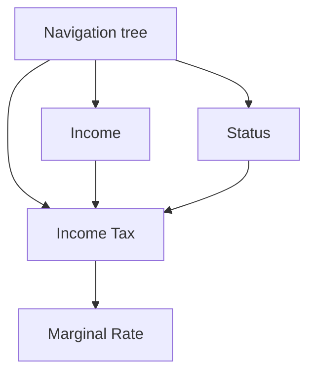

# Trade-off analysis: Calculation engine storage

## Scenario

The Tax Calculation software allows to enter various fields and the tax calculation engine will calculate the result based on complex rules.
Some of the fields are dependent on the answers to other fields and form a tree of dependencies.

This trade-off analysis is evaluating different architectural approaches for storage of the data for the calculation engine that includes rules and input data.

## Attributes

- Performance: The ability of the chosen storage to handle complex calculations efficiently.
- Cost: The financial implications, including licensing and maintenance costs.
- Client Preference: The client's preference for MS SQL Server.
- Reliability: The ability of the storage to handle failures and recover from them.
- Security: The ability of the storage to protect the data from unauthorized access.

## Environment

- Web interface is dynamic and what is show managed by tax rules or form definition in tax rules.
- Fields on the form can trigger recalculation resulting in numeric values recalc (e.g., Forecasted Refund) or answers to questions in interface activate new fields.
- It shall be possible for accountant to change tax rules and form at any time without rebuild of the software.
- Client is biased towards MS SQL Server storage.
- Rules for the calculation engine are similar to a DAG (Directed Acyclic Graph) with nodes being the forms with formulas or input fields and edges being the dependencies between them.

## Architectural approaches

### Example for comparison

The following example is used for comparison of the different approaches.

Let's assume that the calculation engine has the following rules:

### MS SQL Server

SQL Server is a mature relational database management system that is widely used in the industry. It can be used to store various types of data, including graph data using [SQL Graph feature](https://learn.microsoft.com/en-us/sql/relational-databases/graphs/sql-graph-overview?view=sql-server-ver16).

Here is an example of a graph data model for the calculation engine rules:

| $node_id               | Formula                                                                                | Title           | Type        |
|------------------------|----------------------------------------------------------------------------------------|-----------------|-------------|
| {"type":"node","Id":0} |                                                                                        | Tax Calculation | Root        |
| {"type":"node","Id":1} | $Income                                                                                | Income          | Input field |
| {"type":"node","Id":2} | $Status                                                                                | Martial status  | Input field |
| {"type":"node","Id":3} | =IF($Status='Single', $Income*10%)                                                     | Tax             | Formula     |
| {"type":"node","Id":4} | =IFS($Tax>0 AND $Tax<10000, 25%, $Tax >10000 AND $Tax < 20000, 50%, $Tax >20000, 75%)  | Marginal Rate   | Formula     |

| $edge_id                 | $from_id                 | $to_id                   | lazy  |
|--------------------------|--------------------------|--------------------------|-------|
| {"type":"edge", "id": 0} | {"type":"node", "id": 0} | {"type":"node", "id": 1} | true  |
| {"type":"edge", "id": 1} | {"type":"node", "id": 0} | {"type":"node", "id": 2} | true  |
| {"type":"edge", "id": 2} | {"type":"node", "id": 0} | {"type":"node", "id": 3} | true  |
| {"type":"edge", "id": 3} | {"type":"node", "id": 1} | {"type":"node", "id": 3} | false |
| {"type":"edge", "id": 4} | {"type":"node", "id": 2} | {"type":"node", "id": 3} | false |
| {"type":"edge", "id": 5} | {"type":"node", "id": 3} | {"type":"node", "id": 4} | false |

The data model consists of two tables: `nodes` and `edges`. The `nodes` table contains the nodes of the graph and the `edges` table contains the edges of the graph.

The input fields for the calculation engine can be stored as a separate KEY-VALUE like table:

| $node_id               | $value |
|------------------------|--------|
| $Income                | 10000  |
| $Status                | Single |

The calculation engine can be implemented as a micro-service that reads rules from the SQL Server into memory-optimize DAG structures and then performs the calculations using input fields.

#### Performance

In a relational database, when you look up a record in storage, generally the next record is stored right next to it in storage. We might call this a "natural index" because if what you want to do is scan through a bunch of records, the relational structure is just fundamentally set up to make that perform really well.

Graph databases on the other hand are generally naturally indexed by relationships. This means that in general, graph databases traverse relationships very quickly, but perform less well on mass/bulk queries.

In general, SQL Server performance will be much slower for queries that requires traversing the graph and much faster for queries that require SQL-like operations without traversing the graph.

[According to Neo4j](https://neo4j.com/news/how-much-faster-is-a-graph-database-really/) the time to traverse for 2nd degree connections graph database is 60% faster, and for 3rd degree connections graph database is 180 times faster.

#### Outcomes

Pros:

- Client preference for MS SQL Server is satisfied.
- A single storage for both rules, input data, and other system data.
- Available as a managed cloud solution in Azure.

Cons:

- Performance of the calculation engine is significantly slower for queries that require traversing the graph.
- The storage schema is technically and mentally complex and requires a lot of effort to implement and maintain.
- Object-relational impedance mismatch

### Azure Cosmos DB with Gremlin API

Azure Cosmos DB is a globally distributed, multi-model database service that supports document, key-value, wide-column, and graph databases. It is a NoSQL database that supports multiple APIs, including Gremlin API for graph databases.

### Neo4j

## Trade-off analysis table

|    Architectural Decisions    | Sensitivity | Trade-off | Risk | Non-risk |
|-------------------------------|-------------|-----------|------|----------|
| MS SQL Server                 |             | T1        | R1   |          |
| Azure Cosmos DB               |             |           |      |          |
| Neo4j                         |             |           |      |          |

## Reasoning

