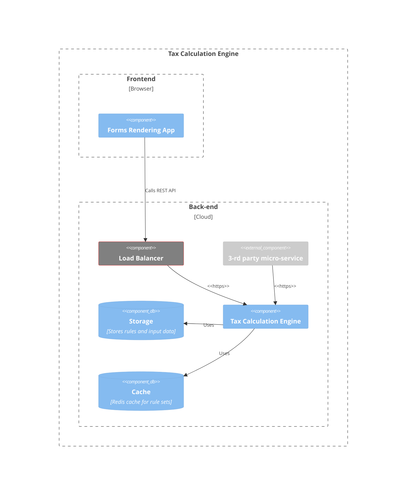
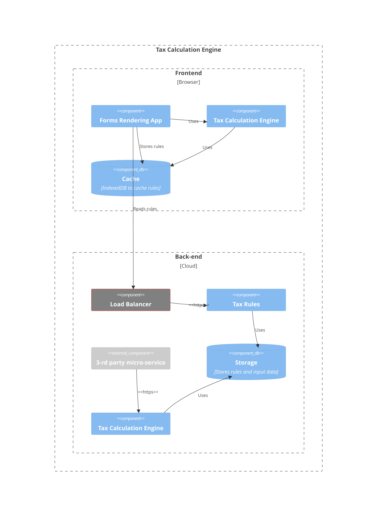

# Trade-off analysis: Calculation engine architecture

## Scenario

The Tax Calculation software allows to enter various fields and the tax calculation engine will calculate the result based on complex rules.
Some of the fields are dependent on the answers to other fields and form a tree of dependencies.

This trade-off analysis is evaluating different architectural approaches for the calculation engine architecture.

## Attributes

- Functional suitability: The calculation engine shall be able to perform calculations based on the rules and input data. It may be called from a web or mobile client, and from an internal micro-service.
- Performance efficiency: The calculation engine shall be able to perform calculations fast under the load.

## Environment

- Web interface is dynamic and what is show managed by tax rules or form definition in tax rules.
- Fields on the form can trigger recalculation resulting in numeric values recalc (e.g., Forecasted Refund) or answers to questions in interface activate new fields
- It shall be possible for accountant to change tax rules and form at any time without rebuild of the software.
- It shall be possible to run Calculation engine as separate micro-service from forms or any other components
- Rules for the calculation engine are similar to a DAG (Directed Acyclic Graph) with nodes being the forms with formulas or input fields and edges being the dependencies between them.
- Other parts of the system are using C# and .NET Core.
- The trade-off analysis of storage options for the rules and input data is [addressed separately](Calculation%20engine%20storage%20trade-off.md).

## Response

- Recalculations shall be performed fast under the 1s at 100 requests per second load for a back-end solution.
- Recalculations shall be performed under 1s for a front-end (mobile/web) solution.
- Tax calculation engine is portable to other platforms, including web and mobile.

## Architectural approaches

### Back-end micro-service

The calculation engine is implemented as a back-end micro-service using C#. It is called by the forms rendering application and by the 3rd party micro-service using REST API protocol.

#### Performance

To satisfy the performance requirements, the API calls for the calculation engine would have a strict time limit of 1s. This will require all rules to be available in-memory or in Redis Cache for fast access.
All calculations should be performed using native data structures (e.g., arrays, dictionaries, etc.) and not sync database queries.

Horizontal scaling and partitioning data by tax year and user ID will be used to satisfy performance and scaling requirements.

#### Outcomes

Pros:

- Highly scallable solution that can be scaled horizontally by adding more instances of the calculation engine.
- The solution could be optimized for performance by doing coupling with the underlying data storage structures like Cosmos BD Graph DB and Redis Cache.
- The calculation is offloaded to the client, so the scalability of the solution is not limited by the calculation engine.

Cons:

- The latency depends on many factors including geographical location of the client, network latency and quality, and the load on the calculation engine.
- The solution is not portable to other platforms like web and mobile.

### Cross-platform Blazor code using WebAssembly and .NET Core

The calculation engine is implemented as a cross-platform C# Blazor code. It is embedded as a WebAssembly to the Forms Rendering Application and also can be used by .NET Library for a tax calculation micro-service.

An encryption of locally cached data may be used to protect the data from tampering and anauthorized access. Blazor WASM is relying on SubtleCrypto API for encryption/hashing. This API is not supported in majority of browsers and platforms, but may have limited or no support in old browsers.

#### Performance

Since the calculation engine will run in-browser it does not require any networks calls to do rules calculations. However, the performance is now dependant on the client's hardware and browser performance.
To maximuze the performance, the AOT compilation should be used to compile the Blazor code to WebAssembly.
In order to minimize impact to the front-end application, the tax calculation engine should be run in web workers with a communication mechanism established between front-end application and tax calculation engine.

We expect the performance of this solution to be at least comparable with such well-known similar applications with in-browser offline calculations like Google Spreadsheet and Office 365 with response latency for usual cases under 1s.

#### Outcomes

Pros:

- The solution is highly portable and can be used in web and mobile applications.
- The solution does not require a network connection to the server and can be used in a fully offline mode.
- Serverless deployment scenarios are possible, such as serving the app from a Content Delivery Network (CDN).

Cons:

- The app is restricted to the capabilities of the browser. There are certain limitations in Blazor WebAssembly that may not allow to use all .NET features, types, and comlicates interop between JavaScript and WASM.
- Download size is larger, and apps take longer to load.
- The app's code can't be protected from inspection and tampering by users which makes security aspects more difficult.

## Trade-off analysis table

|    Architectural Decisions    | Sensitivity | Trade-off | Risk | Non-risk |
|-------------------------------|-------------|-----------|------|----------|
| Micro-service                 |             |  T1       | R1   |          |
| Cross-platform Blazor WASM    |             |  T2       | R2   |          |

## Reasoning

**R1**: Introducing a network call for each re-calculation can make a significant performance impact and may not be acceptable as an real-time solution.
**T1**: The performance of the solution is highly sensitive to the network latency geographical location. To minimize latency the micro-service should be deployed in multiple regions which will increase TOC.
**R2**: Blazor WASM is a new technology that is not yet widely adopted and have significant limitations in terms of compatibility with .NET Core and interopability with JavaScript. Ability of Blazor WASM to perform complex calculations is not yet proven and brings a risk that all requirements may not be satisfied due to technical feasibility and performance limitations. For example, Blazor WASM is [very limited on security alogorithm support](https://github.com/dotnet/designs/blob/main/accepted/2021/blazor-wasm-crypto.md) and interop with JavaScript is [very limited](https://learn.microsoft.com/en-us/aspnet/core/blazor/javascript-interoperability/import-export-interop?view=aspnetcore-7.0)
**T2**: Securing client's data in-browser requires advanced encryption and security measures on the client that will have impact on performance. More advanced encryption algorithms may not be supported by Blazor WASM or significantly affect performance due to interop calls.

## Proposed solution

The proposed solution is to use a cross-platform Blazor 7 WASM code for client-side tax calculation engine. The code of the tax calculation engine should be cross-platform and re-used for tax calculation micro-service.